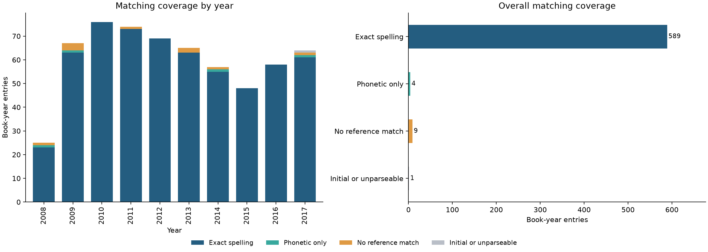

# Phonetic Name Matching Analysis

[](https://github.com/1hugemtf/phonetic-name-matching/actions/workflows/validate.yml)

[View notebook](notebook.ipynb) · [Open in Google Colab](https://colab.research.google.com/github/1hugemtf/phonetic-name-matching/blob/main/notebook.ipynb)

**Author:** Hamed Dhiaa  
**Tools:** Python, pandas, Jellyfish (NYSIIS), Matplotlib, Jupyter

## Question

How much does phonetic matching expand reference coverage beyond exact name spelling?

This project compares normalized first-name tokens from a historical children's picture-book bestseller dataset against an SSA-derived name reference. It measures string-matching coverage and explores phonetic collisions. It does not infer authors' gender, nationality or birthplace.

## Results

| Match category | Book-year entries |
| --- | ---: |
| Exact normalized spelling | 589 |
| Phonetic-only candidate | 4 |
| No reference match | 9 |
| Initial or unparseable token | 1 |
| **Total** | **603** |

The data covers 2008–2017 and contains 230 distinct author strings. Repeated books and authors contribute multiple entries: these totals are **not unique-author counts**. The reference contains 96,174 names after aggregating the source frequencies across categories.

Phonetic matching adds only four candidate matches in this sample. A shared NYSIIS code does not prove identical pronunciation or identity; the notebook shows examples of different spellings sharing a code. Coverage is not accuracy, and no precision/recall claim is made without verified matches.



## Method

1. Normalize case, fold Latin diacritics and remove non-alphabetic characters.
2. Extract the first whitespace-delimited token; keep initials and empty tokens separate.
3. Compute NYSIIS keys for both reference names and author tokens with the same library.
4. Classify matches as exact spelling, phonetic only, no reference match, or initial/unparseable.
5. Compare yearly entry counts and distinct-token counts, inspect code collisions, and export a chart.

## Run in your browser

GitHub displays saved results; it does not run notebook cells interactively. Open the Colab link above, upload **both** `author_entries.csv` and `name_frequencies.csv` using Colab's Files panel, install the phonetic library in a new cell with `!pip install jellyfish==1.2.1`, then select **Runtime → Run all**. Colab execution itself is not part of the automated test; the pinned Python 3.12 environment below is.

## Run locally

Tested with Python 3.12. From a terminal:

```bash
git clone https://github.com/1hugemtf/phonetic-name-matching.git
cd phonetic-name-matching
python -m venv .venv
```

Activate the environment on Windows PowerShell:

```powershell
.venv\Scripts\Activate.ps1
```

Or on macOS/Linux:

```bash
source .venv/bin/activate
```

Then install and open:

```bash
python -m pip install -r requirements.txt
python -m jupyterlab notebook.ipynb
```

Run cells from top to bottom. The notebook writes `matching_coverage.png`.

## Automated checks

```bash
python validate_notebook.py
```

The validator clears outputs and executes all cells in a fresh kernel. It verifies normalization, dotted-initial handling, known match results, matching-category totals, yearly totals, reference membership, chart totals, legend labels and export. It saves freshly executed notebook outputs.

GitHub Actions runs the same checks on pushes and pull requests and makes the executed notebook and chart available as a downloadable artifact.

## Files

| File | Purpose |
| --- | --- |
| `notebook.ipynb` | Executed analysis, chart and interpretation |
| `author_entries.csv` | Supplied NYT book-year records, converted to comma-separated CSV |
| `name_frequencies.csv` | Name frequencies aggregated across the source categories; no demographic labels |
| `matching_coverage.png` | Generated preview |
| `requirements.txt` | Pinned direct dependencies |
| `validate_notebook.py` | Reproducibility and regression checks |
| `.github/workflows/validate.yml` | GitHub-hosted validation |

## Limitations

- NYSIIS is not language-neutral. ASCII normalization may merge spellings or discard non-Latin text.
- The first token is an approximation, not a universal given-name parser. Titles, compound names, pseudonyms and multi-author credits require review.
- An unmatched name indicates reference coverage only. It is not evidence of any personal attribute.
- Historical reference frequencies are not used as weights. The archive does not document their observation period.
- Matching collisions are candidate-generation behaviour, not proof of correct record linkage.

## Data provenance

Adapted from a DataCamp learning exercise supplied with NYT children's picture-book bestseller records and an SSA-derived name-frequency dataset. `author_entries.csv` preserves the supplied author-record columns and rows. `name_frequencies.csv` is produced by reading the source `babynames_ssa.csv` with a semicolon separator, grouping by `Name`, and summing `Frequency` across all supplied categories. The source demographic column and precomputed demographic lookup are not included or used.

NYSIIS keys are recomputed using [Jellyfish](https://pypi.org/project/jellyfish/) rather than mixing implementations. The supplied data remains subject to its respective owners' rights; no blanket licence is granted for third-party data.

## Connect

[Portfolio](https://1huge-dhiaa.carrd.co) · [LinkedIn](https://www.linkedin.com/in/dhiaa-hamed/)
